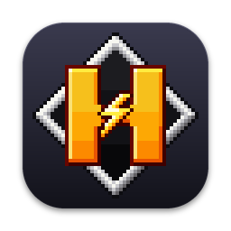
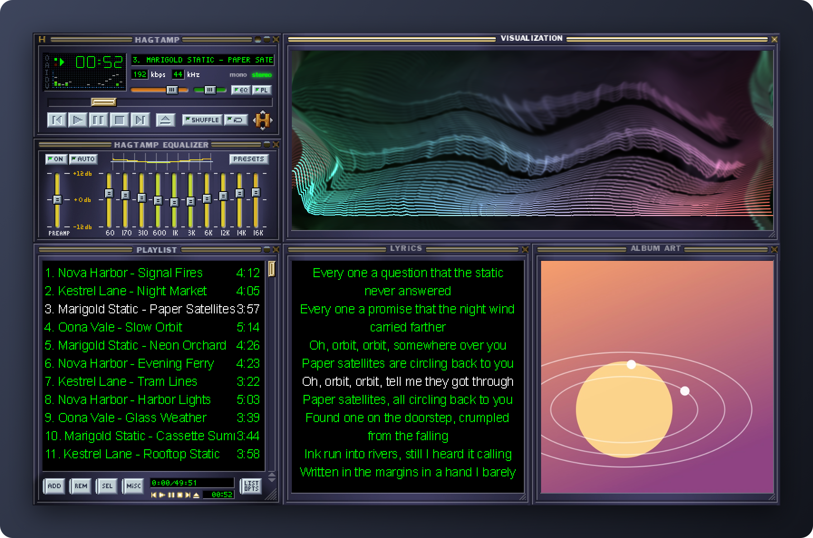
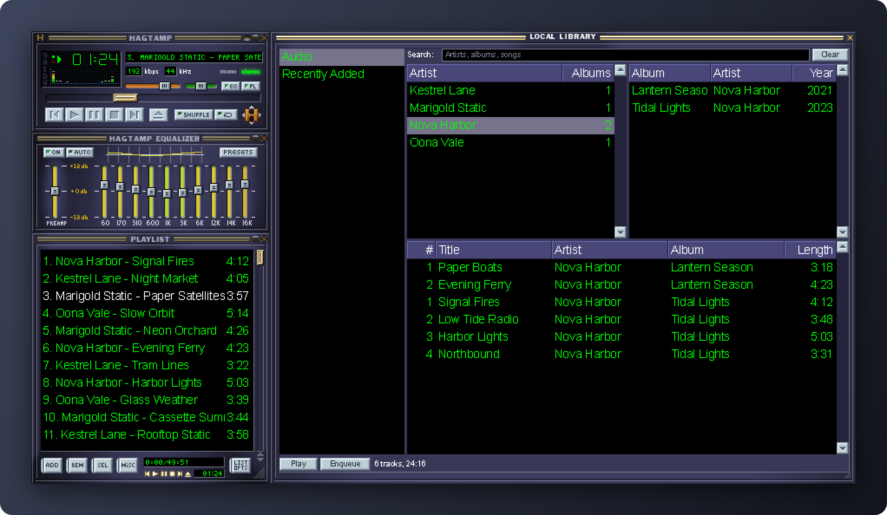
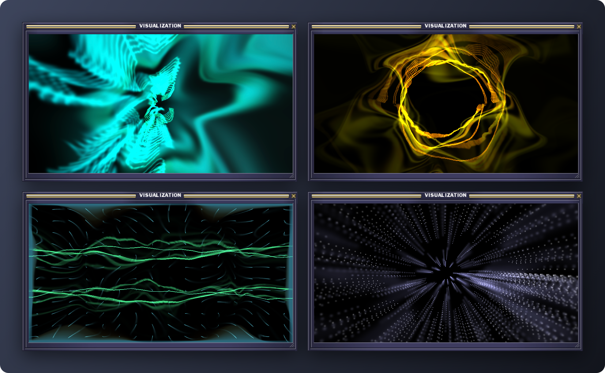

<p align="center">
  
</p>

<h1 align="center">Hagtamp</h1>

<p align="center">
  A native macOS music player that looks and behaves like the classic Winamp&nbsp;2.x,<br>
  skins and all. It plays your local files and your <a href="https://www.navidrome.org">Navidrome</a> server.
</p>



## Features

### Classic skins, pixel for pixel

- The main window, equalizer and playlist are drawn from classic `.wsz` skins at their original pixel size, each with its shade mode, plus double size.
- Windows dock and snap to each other and to screen edges. Docked windows move together and follow each other's size changes.
- Skins bring their own window shapes (`region.txt`), cursors, visualizer colours and playlist colours and font.
- Broken skins still load. A bitmap a skin lacks comes from the base skin.
- The skin browser (⌥S) shows installed skins as they look. Drop a `.wsz` onto any window or open one from Finder to install it.

### Playback

- Gapless playback of MP3, AAC, ALAC, FLAC, Ogg Vorbis, Opus, WavPack, Monkey's Audio, Musepack, WAV, AIFF, tracker modules and more, via [SFBAudioEngine](https://github.com/sbooth/SFBAudioEngine).
- A 10-band equalizer with preamp and presets; `.eqf` files load and save.
- The classic spectrum analyzer and oscilloscope, with all their styles.
- The classic playlist editor: selection, dragging, sorting, jump to file, and `m3u`, `m3u8` and `pls` playlists.
- Internet radio: stream titles show in the marquee.
- Media keys, headphone controls, Control Center and the Now Playing widget.
- Optionally, playback resumes where it was when you quit.

### Navidrome

- A skinned library window: artists, albums, favourites, recently added, playlists and radio stations, with search.
- Tracks start playing while they download. They stay in a cache with a size limit, and the next track is fetched ahead so playback stays gapless.
- Keep albums and playlists offline with a right-click. Without a connection, the library browses from its cache.
- Covers, scrobbling and a choice of stream quality. The login is kept as a token, never the password.

### Local library

- A second library window for the folders you choose. Tags are read in the background.
- It shows artists, albums and tracks, plus recently added music, with search.
- Folders are watched, so new and changed files show up on their own.



### Lyrics and album art

- Lyrics come from Navidrome and its lyrics plugins, or from an `.lrc` file or the lyrics tag for local files.
- Synced lyrics follow the song, and clicking a line jumps there.
- The album art window shows the cover from the file's tags or its folder.

### Visualization

- MilkDrop-style presets (`.milk`) drawn with Metal at a steady 60 fps, in a window or full screen.
- Presets blend from one to the next, and the preset code runs as written: per-frame and per-vertex equations, custom waves and shapes.
- Eight original presets are included. Add your own to `~/Library/Application Support/Hagtamp/Presets`.
- MilkDrop 2 pixel shaders are not supported yet.



## Requirements

- macOS 14 Sonoma or later.
- To build: Xcode with Swift 6 and [XcodeGen](https://github.com/yonaskolb/XcodeGen).

## Building

```sh
brew install xcodegen
make run     # generates the Xcode project, builds and launches the app
make test    # tests of the core package (HagtampKit)
```

The Xcode project is generated from `project.yml` and isn't checked in. Open `Hagtamp.xcodeproj` after `make project` if you prefer Xcode.

## Using it

- **Music:** drop files or folders onto any window, or press L. Right-click the main window for the main menu.
- **Navidrome:** Preferences (⌘,) → Navidrome: the server address, user name and password.
- **Local library:** Preferences → Library: add your music folders, then open the library with ⌥M.
- **Skins:** ⌥S for the skin browser, or File → Open Skin…. Skins are kept in `~/Library/Application Support/Hagtamp/Skins`.
- **Where things live:**
  - `~/Library/Application Support/Hagtamp` holds the playlist, library index, skins, presets and music kept offline.
  - `~/Library/Caches/Hagtamp` holds the audio cache, covers and server responses.

### Keys

The classic keys work in the main, equalizer and playlist windows.

| Key | Action | Key | Action |
|---|---|---|---|
| Z X C V B | previous, play, pause, stop, next | ← → | back / forward 5 s |
| ⇧V | stop with fadeout | ↑ ↓ | volume |
| ⌃V | stop after current | L / ⌃L | play file / play URL |
| S / R | shuffle / repeat | J / ⌃J | jump to file / jump to time |
| ⌃T | elapsed / remaining time | ⌃D | double size |
| ⌃A | always on top | ⌃P or ⌘, | preferences |
| ⌥E / ⌥G | playlist / equalizer | ⌥A / ⌥Y | album art / lyrics |
| ⌥M / ⌥L | local library / Navidrome | ⌃⇧K | visualization |
| ⌥S | skin browser | ⌃Z | start of list |

The visualization window has its own keys:
- Space or → for the next preset, ← for the previous one.
- H for a hard cut, R for random order, L to lock the current preset.
- F or Return for full screen, Esc to leave it.

## Development

- `Packages/HagtampKit` is the testable core:
  - skin loading and rendering (`SkinKit`, `ClassicUI`);
  - the player model (`PlayerCore`) and audio (`AudioCore`, `StreamingInput`);
  - Navidrome (`NavidromeKit`) and the local library (`LibraryKit`);
  - the visualization engine (`Milkdrop`, `MilkdropMetal`).
- `App/Sources` is the AppKit app around that core.
- `make screenshots` regenerates the pictures above. The app plays a made-up library (invented artists, synthesized music, generated covers) in the default skin, muted, and captures its own windows.
- `make corpus` then `make compare` renders about 300 skins from the Skin Museum and diffs them against the museum's screenshots.
- `docs/PLAN.md` has the design decisions, what is done, and the open questions.

## Acknowledgements

[Webamp](https://github.com/captbaritone/webamp) served as the specification for sprite coordinates and window layout. Playback is built on [SFBAudioEngine](https://github.com/sbooth/SFBAudioEngine), skin archives are read with [ZIPFoundation](https://github.com/weichsel/ZIPFoundation), and skins for testing come from the [Winamp Skin Museum](https://skins.webamp.org). See [THIRD_PARTY_NOTICES.md](THIRD_PARTY_NOTICES.md).

Hagtamp is an independent project. It is not affiliated with or endorsed by the owners of Winamp.
